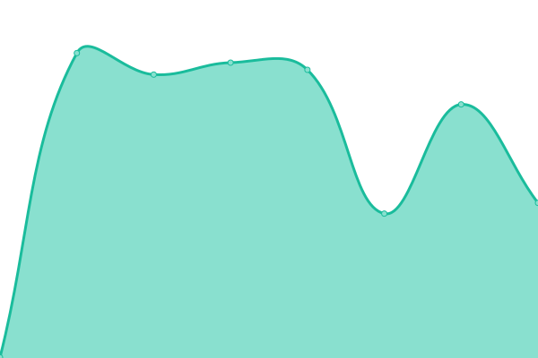
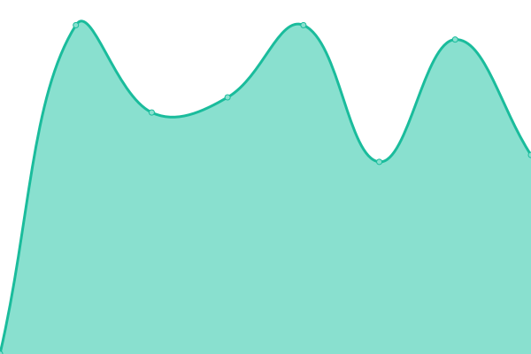

# [📈 Live Status](https://iGrubesic.github.io/expert-disco): <!--live status--> **🟩 All systems operational**

This repository contains the open-source uptime monitor and status page for [Ivona Grubešić](https://iGrubesic.github.io/expert-disco), powered by [Upptime](https://github.com/upptime/upptime).

With [Upptime](https://upptime.js.org), you can get your own unlimited and free uptime monitor and status page, powered entirely by a GitHub repository. We use [Issues](https://github.com/iGrubesic/expert-disco/issues) as incident reports, [Actions](https://github.com/iGrubesic/expert-disco/actions) as uptime monitors, and [Pages](https://iGrubesic.github.io/expert-disco) for the status page.

<!--start: status pages-->
<!-- This summary is generated by Upptime (https://github.com/upptime/upptime) -->
<!-- Do not edit this manually, your changes will be overwritten -->
<!-- prettier-ignore -->
| URL | Status | History | Response Time | Uptime |
| --- | ------ | ------- | ------------- | ------ |
|  [Audiomob](https://audiomob.io/) | 🟩 Up | [audiomob.yml](https://github.com/iGrubesic/expert-disco/commits/HEAD/history/audiomob.yml) | 

 460ms
     
 | 

<a href="https://iGrubesic.github.io/expert-disco/history/audiomob">100.00%</a>
    

|  [Advertiser](http://advertiser.audiomob.io/) | 🟩 Up | [advertiser.yml](https://github.com/iGrubesic/expert-disco/commits/HEAD/history/advertiser.yml) | 

 1756ms
     
 | 

<a href="https://iGrubesic.github.io/expert-disco/history/advertiser">100.00%</a>
    

|  [Developer](https://developer.audiomob.io/) | 🟩 Up | [developer.yml](https://github.com/iGrubesic/expert-disco/commits/HEAD/history/developer.yml) | 

 405ms
     
 | 

<a href="https://iGrubesic.github.io/expert-disco/history/developer">100.00%</a>
    

|  [DemoAdvertiser](https://demo.advertiser.audiomob.io/) | 🟩 Up | [demo-advertiser.yml](https://github.com/iGrubesic/expert-disco/commits/HEAD/history/demo-advertiser.yml) | 

 1441ms
     
 | 

<a href="https://iGrubesic.github.io/expert-disco/history/demo-advertiser">100.00%</a>
    

<!--end: status pages-->

[**Visit our status website →**](https://iGrubesic.github.io/expert-disco)

## 📄 License

- Powered by: [Upptime](https://github.com/upptime/upptime)
- Code: [MIT](./LICENSE) © [Ivona Grubešić](https://iGrubesic.github.io/expert-disco)
- Data in the `./history` directory: [Open Database License](https://opendatacommons.org/licenses/odbl/1-0/)
